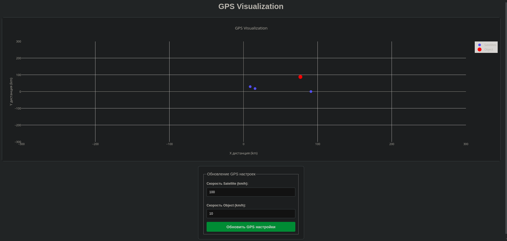

# GPS Visualization
Completed

## Project Overview
This project is a web-based GPS visualization system that connects to a GPS emulation service via WebSocket. It processes real-time data and visualizes the positions of an object and satellites on a Cartesian coordinate graph.



## Features

- Displays the positions of an object and multiple satellites on a Cartesian coordinate graph, updating automatically as new GPS data is received.
- Establishes a WebSocket connection to the GPS emulation service, receiving GPS data in real-time and processing it as it arrives.
- Provides an intuitive user interface to adjust GPS parameters, such as satellite and object speeds, and sends the updated configuration to the GPS emulation service through an API.

## How to Run

### 1. Set up the GPS Emulation Service
To run the GPS emulation service, use Docker:

```bash
docker pull iperekrestov/university:gps-emulation-service
docker run --name gps-emulator -p 4001:4000 iperekrestov/university:gps-emulation-service
```

### 2. Set up the Web Application
1. **Install Dependencies**:
   Run the following command to install the required dependencies:

   ```bash
   npm install
   ```

2. **Start the Web Application**:
   - Start the live server and select the `public` folder:

   ```bash
   npm start
   ```

   Alternatively, you can use:

   ```bash
   live-server
   ```